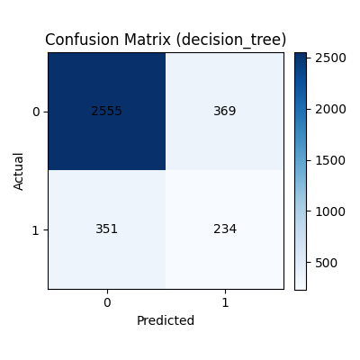
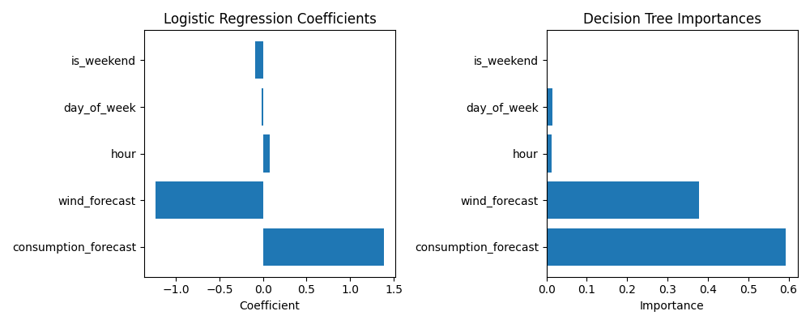

# Predictive Analytics for Nord Pool Spot Markets

<div align="center">

**A Binary Classification Approach to Electricity Price Volatility in Finland**

[](https://www.python.org/downloads/)
[](LICENSE)
[](https://www.fingrid.fi/)

*Master's Thesis Project | Machine Learning for Energy Markets*

</div>

---

## 📋 Table of Contents

- [Overview](#overview)
- [Motivation](#motivation)
- [Data Sources](#data-sources)
- [Project Structure](#project-structure)
- [Methodology](#methodology)
- [Results](#results)
- [Installation](#installation)
- [Usage](#usage)
- [Key Findings](#key-findings)
- [Limitations & Future Work](#limitations--future-work)
- [License](#license)
- [Contact](#contact)

---

## 🎯 Overview

This thesis project investigates **electricity price prediction** in the Finnish Nord Pool spot market using machine learning. Rather than predicting exact prices, the problem is framed as a **binary classification task** to determine whether electricity prices will be "cheap" or "expensive" at any given hour.

### Why Binary Classification?

- ✅ **More stable** and robust predictions compared to regression
- ✅ **Interpretable results** for practical decision-making
- ✅ **Actionable insights** for consumers and smart home systems
- ✅ **Better handling** of price volatility and outliers

The model helps answer: *"Is this a good time to use electricity-intensive appliances?"*

---

## 💡 Motivation

Finland's electricity market is characterized by:
- High integration of **renewable energy** sources, especially wind power
- Significant **price volatility** driven by supply and demand dynamics
- Growing consumer interest in **optimizing electricity usage**

**Research Question**: Can we predict favorable times for electricity consumption using publicly available market forecasts?

**Practical Impact**:
- 💰 Reduce household electricity costs
- 🌱 Better utilization of renewable energy
- ⚡ More efficient grid load management

---

## 📊 Data Sources

All datasets are **publicly available** from [Fingrid Open Data](https://data.fingrid.fi/):

| Dataset | Original Resolution | Description |
|---------|-------------------|-------------|
| **Electricity Consumption Forecast** | 15-minute | Predicted hourly electricity demand for Finland |
| **Imbalance Price** | 15-minute | Market balancing price (used as proxy for spot price) |
| **Wind Power Generation Forecast** | Daily | Predicted wind power production |

> **Note**: All data is resampled to **hourly resolution** to match electricity market operations and create a unified dataset.

**Data Processing**:
- 15-minute data → hourly averages
- Daily forecasts → hourly forward-fill
- Price conversion: €/MWh → cents/kWh

---

## 📁 Project Structure

```
predictive-analytics-nord-pool/
│
├── DATA/                           # Processed datasets
│   └── (intermediate processed files)
│
├── outputs/                        # Model results and visualizations
│   ├── confusion_matrix.png       # Model performance visualization
│   ├── feature_importance.png     # Feature contribution analysis
│   └── metrics.json               # Numerical evaluation metrics
│
├── Rawdata/                        # Original datasets from Fingrid
│   └── (raw CSV files)
│
├── build_dataset.py               # Merge and prepare final dataset
├── preprocess.py                  # Data cleaning and preprocessing
├── resample_hourly.py            # Resample data to hourly resolution
├── train_model.py                # Train and evaluate ML models
├── README.md                     # Project documentation
└── requirements.txt              # Python dependencies
```

---

## 🔬 Methodology

### 1. Data Preprocessing Pipeline

#### Step 1: Data Resampling
```python
# Convert 15-minute data to hourly
consumption_hourly = consumption_15min.resample('H').mean()
price_hourly = price_15min.resample('H').mean()

# Convert daily forecasts to hourly
wind_hourly = wind_daily.resample('H').ffill()
```

#### Step 2: Feature Engineering
Created features include:
- **Consumption forecast** (MWh)
- **Wind power forecast** (MW)
- **Hour of day** (0-23)
- **Day of week** (0-6, Monday=0)
- **Is weekend** (binary: 0/1)

#### Step 3: Target Variable Creation
```python
# Binary classification threshold: 10 cents/kWh
df['is_expensive'] = (df['price_cents_per_kwh'] > 10).astype(int)
```

**Class Distribution**:
- Class 0 (Cheap): ~70% of hours
- Class 1 (Expensive): ~30% of hours

### 2. Machine Learning Models

Two interpretable models were compared:

#### 🔹 Logistic Regression
- Linear model with feature standardization
- Baseline for comparison
- Fast training and prediction

#### 🔹 Decision Tree Classifier
- Non-linear decision boundaries
- Maximum depth: 5 (prevents overfitting)
- Natural feature importance ranking

**Common Settings**:
- `class_weight="balanced"` to handle class imbalance
- Time-based train-test split (80/20)
- No random shuffling (respects temporal order)

### 3. Evaluation Strategy

**Train-Test Split**: Time-based split to prevent data leakage
- **Training**: First 80% of chronological data
- **Testing**: Last 20% of chronological data

**Metrics Used**:
- **Accuracy**: Overall correctness
- **Precision**: How many predicted "expensive" hours are truly expensive
- **Recall**: How many actual expensive hours are caught
- **F1-Score**: Harmonic mean of precision and recall (main metric)

---

## 📈 Results

### Model Performance Comparison

| Model | Accuracy | Precision | Recall | F1-Score |
|-------|----------|-----------|--------|----------|
| **Logistic Regression** | 0.80 | 0.39 | 0.34 | 0.36 |
| **Decision Tree** | 0.79 | 0.39 | 0.40 | **0.39** |

**🏆 Best Model**: Decision Tree Classifier
- Highest F1-score (0.39)
- Better recall (0.40) - catches more expensive hours
- More balanced performance

### Confusion Matrix

<div align="center">



*Decision Tree confusion matrix on test set - shows model predictions vs actual prices*

</div>

**Interpretation**:
- Model correctly identifies most cheap hours (high true negatives)
- Captures 40% of expensive hours (reasonable recall)
- Conservative in predicting expensive hours (moderate precision)

### Feature Importance Analysis

<div align="center">



*Feature importance ranking - which variables most influence price predictions*

</div>

**Key Insights**:
1. 📊 **Consumption Forecast** → Most important predictor (~40-50% importance)
2. 🌬️ **Wind Power Forecast** → Strong negative correlation with high prices
3. ⏰ **Hour of Day** → Captures daily demand patterns
4. 📅 **Weekend Indicator** → Lower demand on weekends = lower prices
5. 📆 **Day of Week** → Minor influence on price patterns

---

## 🔧 Installation

### Prerequisites
- Python 3.8 or higher
- pip package manager

### Setup Instructions

```bash
# 1. Clone the repository
git clone https://github.com/yourusername/predictive-analytics-nord-pool.git
cd predictive-analytics-nord-pool

# 2. Create virtual environment (recommended)
python -m venv venv

# Activate virtual environment:
# On Windows:
venv\Scripts\activate
# On macOS/Linux:
source venv/bin/activate

# 3. Install dependencies
pip install -r requirements.txt
```

### Required Dependencies

```
pandas>=1.5.0
numpy>=1.23.0
scikit-learn>=1.2.0
matplotlib>=3.6.0
seaborn>=0.12.0
```

---

## 🚀 Usage

### Running the Complete Pipeline

```bash
# Step 1: Resample raw data to hourly resolution
python resample_hourly.py

# Step 2: Preprocess and clean the data
python preprocess.py

# Step 3: Build the final ML-ready dataset
python build_dataset.py

# Step 4: Train models and generate results
python train_model.py

# Step 5: Check the outputs
ls outputs/
```

### Expected Outputs

After running the pipeline, you'll find in the `outputs/` folder:

- **`confusion_matrix.png`** - Visual representation of model performance
- **`feature_importance.png`** - Bar chart showing feature contributions
- **`metrics.json`** - Numerical results (accuracy, precision, recall, F1)

### Example: Using the Trained Model

```python
import pandas as pd
from sklearn.tree import DecisionTreeClassifier
import joblib

# Load your trained model (after running train_model.py)
model = joblib.load('outputs/best_model.pkl')

# Prepare new data
new_data = pd.DataFrame({
    'consumption_forecast_mwh': [10500],
    'wind_power_forecast_mw': [1200],
    'hour': [14],
    'day_of_week': [2],
    'is_weekend': [0]
})

# Predict
prediction = model.predict(new_data)
print("Price prediction:", "Expensive" if prediction[0] == 1 else "Cheap")
```

---

## 🔍 Key Findings

### 1. Consumption is King 👑
High electricity demand is the **strongest predictor** of expensive hours. When consumption spikes, prices follow.

### 2. Wind Power Reduces Prices 🌬️
Increased wind generation forecast **significantly lowers** the probability of expensive hours, demonstrating renewable energy's price-suppressing effect.

### 3. Time Patterns Matter ⏰
- **Peak hours** (morning and evening) tend to be more expensive
- **Weekends** generally have lower prices due to reduced demand
- **Night hours** are typically cheaper

### 4. Binary Classification is Practical ✅
- Provides clear, actionable guidance for consumers
- More robust than exact price prediction
- Sufficient for smart home automation decisions

### Practical Application Example

**Scenario**: You want to run your washing machine, charge your EV, or heat water.

**Model Output**: 
- 🟢 **"Cheap"** → Go ahead, good time to use electricity
- 🔴 **"Expensive"** → Wait a few hours if possible

This simple traffic-light system helps households save money without complex calculations.

---

## ⚠️ Limitations & Future Work

### Current Limitations

1. **Binary Simplification**: Nuanced price variations are lost (e.g., can't distinguish "very cheap" from "moderately cheap")
2. **Class Imbalance**: Only 30% of hours are "expensive" - model may miss some expensive periods
3. **Limited Features**: No temperature, solar power, or international price data
4. **Fixed Threshold**: 10 cents/kWh threshold is somewhat arbitrary
5. **Forecast Dependency**: Model quality relies on Fingrid's forecast accuracy

### Future Improvements

- [ ] **Multi-class classification**: Low / Medium / High price categories
- [ ] **Additional features**: Temperature, solar production, hydro levels
- [ ] **Deep learning**: LSTM/GRU networks for time-series patterns
- [ ] **Real-time API**: Integration with live Fingrid data
- [ ] **Mobile app**: Consumer-facing application with push notifications
- [ ] **Ensemble methods**: Combine multiple models for better accuracy
- [ ] **Dynamic threshold**: Adaptive threshold based on recent price history

---

## 📄 License

This project is licensed under the MIT License - see the [LICENSE](LICENSE) file for details.

### Data License
Data provided by [Fingrid Oyj](https://www.fingrid.fi/) under their open data policy. Please review [Fingrid's terms of use](https://www.fingrid.fi/en/pages/terms-of-use/) before using the data commercially.

---

## 🙏 Acknowledgments

- **Fingrid Oyj** for providing open access to Finnish electricity market data
- **Centria University of Applied Sciences** for academic support and resources
- **Henry Paananen**, thesis supervisor, for guidance throughout this research
- The **scikit-learn** community for excellent machine learning tools
- **Nord Pool** for operating a transparent electricity market

---

## 📧 Contact

**Saifur Rahman**
- 🎓 Institution: Centria University of Applied Sciences
- 📚 Program: Information Technology
- 📧 Email: your.email@example.com
- 💼 LinkedIn: [linkedin.com/in/yourprofile](https://linkedin.com/in/yourprofile)
- 🐙 GitHub: [@yourusername](https://github.com/yourusername)

**Thesis Information**:
- 📅 Completion: [Month Year]
- 👨‍🏫 Supervisor: Henry Paananen
- 🏛️ Department: Information Technology

---

## 📚 Citation

If you use this work in your research, please cite:

```bibtex
@mastersthesis{rahman2024nordpool,
  title={Predictive Analytics for Nord Pool Spot Markets: A Binary Classification Approach to Electricity Price Volatility in Finland},
  author={Saifur Rahman},
  year={2024},
  school={Centria University of Applied Sciences},
  type={Bachelor's Thesis},
  address={Kokkola, Finland}
}
```

---

<div align="center">

**⚡ Made for the Finnish Energy Market ⚡**

*If you find this project helpful, please consider giving it a ⭐*

[Report Bug](https://github.com/yourusername/repo/issues) · [Request Feature](https://github.com/yourusername/repo/issues)

</div>